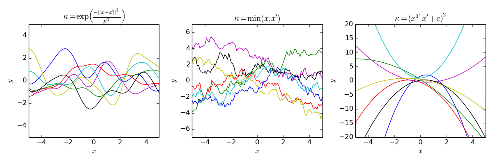

# Gaussian Processes
You could think of Gaussian Procesesses as functions of random variables. So it won't have a defined value for every point of its domain, but a media and a variance. In fact, we can define our Gaussian process with a media, and covariance "K" (the relation between two random variables). 
For our particular aplication, making Gaussian Process regresion is important because we can then have a value of uncertainty (the variance) for every point on the domain of our function. Wich will later let us determine the best next point to evaluate.

## Want to know more?

If you want to know more, you should read [Gaussian Processes for Machine Learning](http://www.gaussianprocess.org/gpml/chapters/RW.pdf?source=post_page---------------------------)