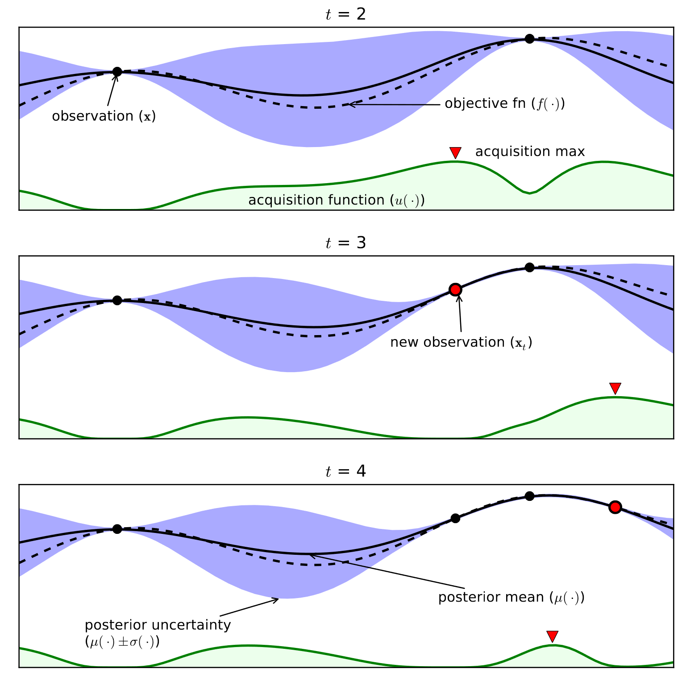

# Autonomus-Reinforcement-Learning
## Abstract
The use of reinforcement learning algorithms to solve diferent problematics, rapidly becomes a complex task, being the main problem, the proper selection of hyper-parameters. Resulting in the general public avoiding to use such "advance" programs.
<br>
in order to bring these barriers down, we decide to analyze and implement Bayesian Optimization algorithms in the automatic selection of hyper-parameters.
<br>
## First of all: What is RL?
Machine learning algorithms devide into three main categories:
1. Supervised learning
2. Unsupervised learning
3. Reinforcement learning

To make things short, while supervised and unsupervised learning rely on a given set of data. RL, instead, gathers information from the environment it's in through interaction. This means that the data it gets depends on the correct selection of hyper-parameters (We will see later why this is important).

## How does it work?


As you can see in the image above, the agent gives an action (or decision) to the environment, and the second, gives a new state and a reward back. This loop is what the agent uses to adjust it's policy and maximize the overall reward.

The exact calculation that the agent does to adjust it's policy varies, but usually follows the lines of a Q-learning algorithm.


In this simple equation, we can allready see some hyper-parameters showing up. For the rest of this essay we will refeer to this hyper-parameters as "Algoithm hyper-parameters". The propper adjustment of theese values is key to face problems such as the "exploration vs eplotation dilemma".

## hyper-parameter hierarchy


<!--  -->
## What is Bayesian Optimization?
Bayesian Optimization is actually as strategy, that takes it's name from Thomas Bayes, a British matematician and presbyterian minister that is best known for the Bayes' theorem (or Bayes' rule), wich describes the probability of an event, based on prior knowledge of conditions that might be related to the event.


This strategy consists on treating the unknown objective function as random and place a prior over it. Then, we evaluate the function and update our prior beliefs to get the posterior distribution.<br>
On the other hand, we use the posterior distribution to form an acquisition function that help us determine our next query point based on a given criteria, and the cycle starts again.



## How do we "update our beliefs"?
To update our beliefs we use something called Gaussian Processes. Wich to make things a little simpler, we can describe as a set of random variables indexed by time or space. Why do we use this? because it allows us to know not only the average, but the level of uncertainty we have in every point of the domain of our function.

## One last thing before we propose an algorithm to implement all this
As you have already realize, the amount of hyper-parameters we can optimize is limited by the speed of our calculations. It gets exponentially harder for every hyper-parameter we try to optimize.<br>
With this in mind, we will make use of the prior hyper-parameter clasification we talk about.

## The algorithm
* Θp => Set of prior algorithm hyper-parameters
```
for model_evaluation in range(N):

    Obtain point Θn that optimizes reward with Θp seted for algorithm hyper-parameters
    D1.append({Θn, f(Θn)})
    Θ+ = argmax(D1)
    D2 = {Θ+, f (Θ+)}

    for algorithm_evaluation in range(M):
        Obtain point Θm that optimizes reward with Θp seted for model_hyperparameters
        D2.append({Θm, f(Θm)})    

    Θp = Θa # Θa -> the best set of hyper-parameters

return argmax(f),max(f)
```

## Case study
### Problem
We will be testing our algorithm in the [Cart-Pole](https://gym.openai.com/envs/CartPole-v1/) problem defined by Sutton in the book "Reinforcement Learning", and implemented in the library [gym.openai](http://gym.openai.com/)

### Comparison
We will compear our algorithm with a random search and a
decoupled Bayesian Optimization. For that we will run each algorithm ten times, each run comprised of 30 meta-episodes for hyper-parameter optimization, and each meta-episode involving completing 3000 episodes where the agent must learn a control policy from scratch using a given setting of hyper-parameters.

### Hyper-parameters to optimize
The list of hyper-parameters we will be optimizing is
1. Model hyper-parameters
    * Learning algorithm: a ∈ {Q-learning, SARSA}
    * Eligibility traces t ∈ {True, False}
    * Exploration p ∈ {e-greedy, Softmax}
    * Exploration reduction per episode, e-decay ∈ {True, False}
2. Algorithm hyper-parameters
    * α ∈ (0, 1)
    * e ∈ (0, 1)
    * γ ∈ (0, 1)
    * λ ∈ (0, 1) (if used)
    * e-decay ∈ (10−3, 10−2) (if used)
    * number of bins for cart state discretization dc ∈ (5, 20)
    * number of bins for pole state discretization dp ∈ (5, 20)

### Hardware used
Desktop PC with 10Gb RAM and a 4x3.20 Ghz processor.

### Results


## Conclusions

Being able to perfect this algorithms for the general public, is crucial to give people more time to focus on specifying the reward function of their problem.<br>
This last task is much more problem specific, and demands the user to know more about the objective of the learning process, and the area the problem is in.<br>
The general rules we have are not certain; And spending time and effort adjusting our algorithm for each problem is not practical. If we want people in different areas to use machine learning, we must first make it consistant and simple.

# Thanks
