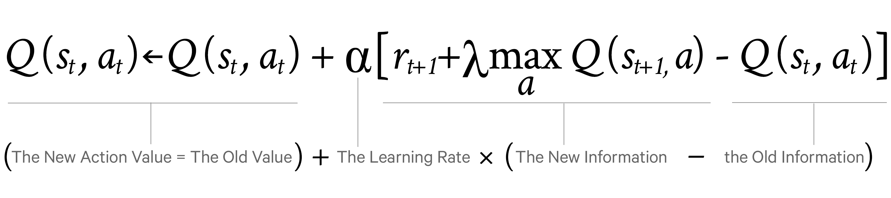

# Reinforcement Learning
As you might already know, machine learning algorithms devide into three main categories:
1. Supervised learning
2. Unsupervised learning
3. Reinforcement learning

While supervised and unsupervised learning algorithms rely on a given data set to train, reinforcement learning algorithms gather information from an interaction where the agent takes actions, transition to a new a state, and recives a reward from the enviroment. 

## How does the agent learns?
The learning process of our RL agent is based on it's policy. A policy is basically a function that gives us the probability of taking an action "a" in a given state "s". Every episode the agent takes the overall reward, and adjust it's policy. 
There are many algorithms to make this adjustment. But probabily the most famous is the Q-learning algorithm.

Q-learning algorithm

## Want to know more?
You can learn more about Reinforcement Learning on Sutton's book:
[Reinforcement learning](https://web.stanford.edu/class/psych209/Readings/SuttonBartoIPRLBook2ndEd.pdf)